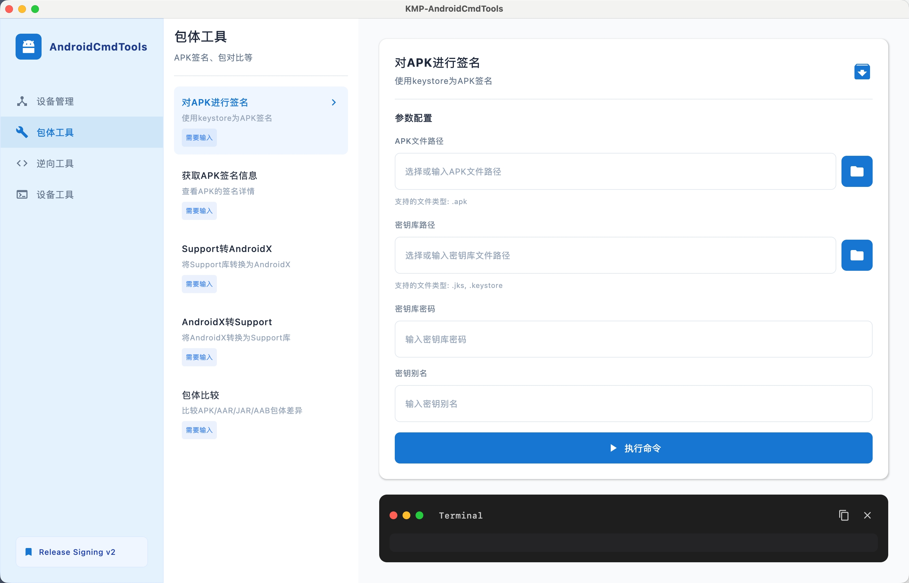
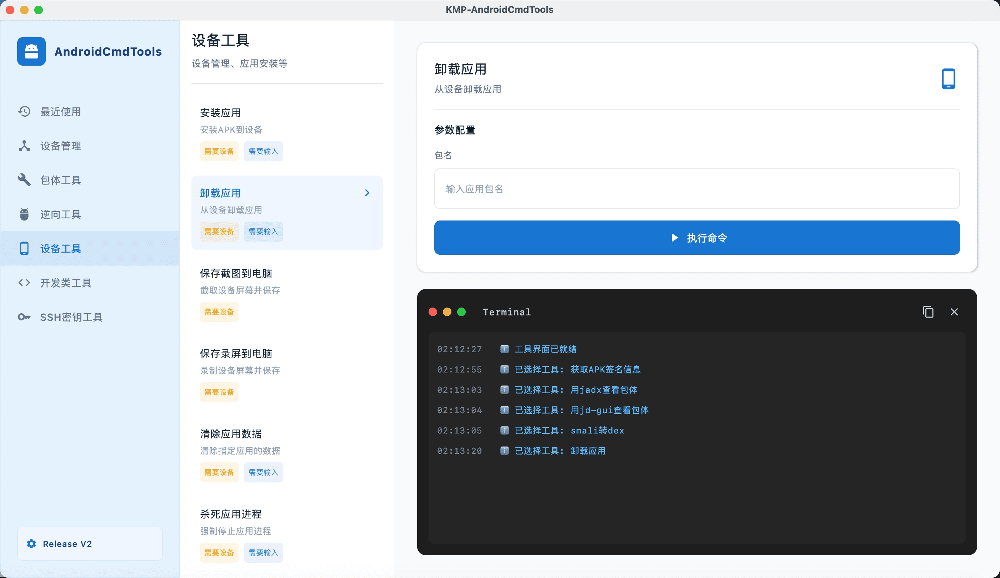
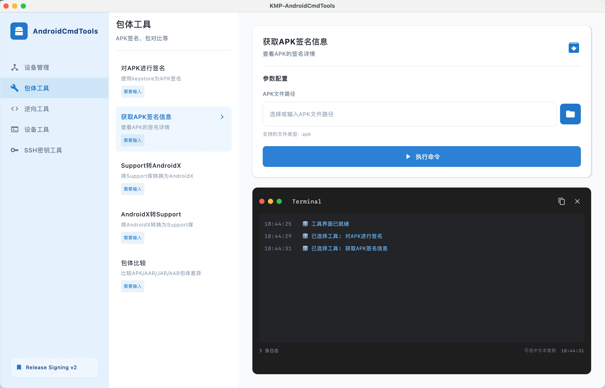

# kmpact - AndroidCmdTools Compose Multiplatform

<div align="center">


**一个基于 Compose Multiplatform 的 Android 开发工具集成平台**

</div>

---

## 📖 项目简介

KMP-AndroidCmdTools 是一个将 AndroidCmdTools 的 50+ 个 Shell 脚本工具集成到现代化 Compose Multiplatform 应用中的项目。提供直观的图形界面，让 Android 开发者能够轻松使用各种命令行工具，无需记忆复杂的命令参数。

### 核心特性

- 🎨 **现代化 UI**: 基于 Material Design 3 的清爽界面
- 🏗️ **MVI 架构**: 单向数据流，状态管理清晰
- 🔧 **50+ 工具**: 涵盖包体、设备、逆向、密钥等多个领域
- 📊 **实时日志**: iTerm 风格的终端日志，实时显示命令执行过程
- 🔒 **安全保护**: 自动检测危险目录，防止误删除数据
- 💬 **实时交互**: 支持命令执行过程中的实时输入
- 🌐 **跨平台**: 支持 MacOS、Windows
- 📝 **完整注释**: 所有代码都有详细的中文注释

---

## 📸 界面预览








---

## 🚀 快速开始

### 环境要求

- JDK 17 或更高版本
- Gradle 8.0 或更高版本
- macOS / Linux / Windows

### 安装步骤

1. **克隆项目**

```
git clone https://github.com/oooooooko/kmpact.git
cd kmpact
```

2. **编译项目**

```
./gradlew composeApp:compileKotlinJvm
```

3. **运行应用**

```
./gradlew composeApp:run
```

### 打包发布

#### macOS (DMG)

打包为 macOS 应用程序：

```
./gradlew composeApp:packageDmg
```

生成的 DMG 文件位于：
```
composeApp/build/compose/binaries/main/dmg/
```

#### Windows (MSI)

打包为 Windows 安装程序：

```
./gradlew composeApp:packageMsi
```

生成的 MSI 文件位于：
```
composeApp/build/compose/binaries/main/msi/
```

---

## ✨ 功能特性

### 📦 包体工具 (5个)

- **对APK进行签名**: 使用 keystore 为 APK 签名
- **获取APK签名信息**: 查看 APK 的签名详情
- **Support转AndroidX**: 将 Support 库转换为 AndroidX
- **AndroidX转Support**: 将 AndroidX 转换为 Support 库
- **包体比较**: 比较 APK/AAR/JAR/AAB 包体差异

### 📱 设备工具 (30个)

#### 基础操作 (10个)
- **安装应用**: 安装 APK 到设备
- **卸载应用**: 从设备卸载应用
- **保存截图**: 截取设备屏幕并保存到电脑
- **保存录屏**: 录制设备屏幕并保存到电脑
- **清除应用数据**: 清除指定应用的数据
- **杀死应用进程**: 强制停止应用进程
- **查看Logcat**: 实时查看设备日志
- **导出APK**: 从设备导出已安装的 APK
- **设备重启**: 重启 Android 设备
- **设备关机**: 关闭 Android 设备

#### 高级操作 (13个)
- **连接无线ADB**: 通过 WiFi 连接设备
- **断开无线ADB**: 断开 WiFi 连接的设备
- **授予应用权限**: 授予应用指定权限
- **撤销应用权限**: 撤销应用指定权限
- **启用应用**: 启用被禁用的应用
- **禁用应用**: 禁用指定应用
- **设置全局代理**: 设置设备全局 HTTP 代理
- **清除全局代理**: 清除设备全局代理设置
- **获取屏幕信息**: 查看设备屏幕分辨率等信息
- **获取顶层Activity**: 查看当前顶层 Activity 信息
- **查看设备CPU架构**: 查看设备CPU架构和ABI信息
- **导出ANR日志**: 导出应用 ANR 崩溃日志
- **管理设备文件**: 浏览和管理设备文件系统
- **运行Monkey测试**: 执行随机压力测试

#### 模拟操作 (7个)
- **点击屏幕**: 模拟点击屏幕指定坐标
- **输入文本**: 模拟输入文本内容
- **按返回键**: 模拟按下返回键
- **按Home键**: 模拟按下 Home 键
- **按菜单键**: 模拟按下菜单键
- **按电源键**: 模拟按下电源键
- **按任务键**: 模拟按下任务切换键

### 🔧 逆向工具 (11个)

#### APK反编译 (2个)
- **apktool反编译**: 反编译 APK 到 smali 代码
- **apktool回编译**: 从 smali 代码回编译 APK

#### 源码查看 (2个)
- **jadx查看**: 使用 jadx 查看 APK 源码
- **jd-gui查看**: 使用 jd-gui 查看 JAR 源码

#### 格式转换 (7个)
- **dex转jar**: 将 dex 文件转换为 jar
- **jar转dex**: 将 jar 文件转换为 dex
- **dex转smali**: 将 dex 文件转换为 smali 代码
- **smali转dex**: 将 smali 代码转换为 dex
- **dex转class**: 将 dex 文件转换为 class 文件
- **class转dex**: 将 class 文件转换为 dex

### 🔑 密钥工具 (4个)

- **创建SSH密钥**: 生成新的 SSH 密钥对
- **删除SSH密钥**: 删除指定的 SSH 密钥
- **查询SSH公钥**: 查看 SSH 公钥内容
- **打开SSH密钥目录**: 在文件管理器中打开 .ssh 目录


---

### 技术栈

- **Kotlin**: 2.3.0
- **Compose Multiplatform**: 1.10.0
- **Kotlin Coroutines**: 异步操作
- **kotlinx-datetime**: 时间处理
- **Material Design 3**: UI 设计

---

## 🌟 功能亮点

### 💬 实时交互输入

支持命令执行过程中的实时输入，无需等待命令结束：

- **自动检测输入需求**：识别"请选择"、"请输入"、"是否"等关键词
- **快捷输入标签**：提供常用路径（下载、桌面）和快捷输入（y/n、0-9）
- **回车支持**：可发送空行，支持需要回车确认的场景

### 📱 设备管理

- **自动检测设备**：实时显示已连接的 Android 设备
- **设备详情**：显示设备型号、Android 版本、序列号等信息
- **多设备支持**：可选择特定设备执行命令

### 🎨 现代化界面

- **左右分栏布局**：左侧工具列表，右侧参数配置和日志输出
- **iTerm 风格终端**：macOS 风格的终端窗口，支持日志级别高亮
- **实时日志**：命令执行过程实时显示，支持复制日志内容
- **取消执行**：可随时取消正在执行的命令

---

## 📱 使用指南

### 基本操作

1. **选择工具分类**
   - 从左侧侧边栏选择：设备工具、包体工具、逆向工具或密钥工具

2. **选择具体工具**
   - 在工具列表中点击要使用的工具

3. **填写参数**
   - 在右侧参数配置区域填写必要的参数
   - 如：APK 文件路径、应用包名等

4. **执行命令**
   - 点击"执行命令"按钮
   - 在终端日志区域查看执行过程和结果

### 示例：安装 APK

```
1. 选择"设备工具"
2. 选择"安装应用"
3. 填写 APK 文件路径：/path/to/app.apk
4. 点击"执行命令"
5. 查看日志输出
```

---

## 🔧 开发

### 添加新命令

1. 在 `ToolCategory.kt` 中定义命令：

```kotlin
val MY_COMMAND = ToolCommand(
    id = "my_command",
    name = "我的命令",
    description = "命令描述",
    category = ToolCategory.DEVICE_TOOLS,
    scriptPath = "shell/device-tools/MyCommand.sh",
    requiresDevice = true,
    requiresInput = true
)
```

2. 在 `ToolsScreen.kt` 中添加参数输入（如果需要）：

```kotlin
when (command.id) {
    "my_command" -> {
        ParameterTextField(
            label = "参数名称",
            value = parameters["paramName"] ?: "",
            onValueChange = { onParameterChange("paramName", it) }
        )
    }
}
```

3. 将命令添加到 `getAllCommands()` 列表中

## 🛠️ 技术栈

### 前端框架
- **Kotlin**: 2.3.0 - 现代化的编程语言
- **Compose Multiplatform**: 1.10.0 - 跨平台 UI 框架
- **Material Design 3**: 最新的 Material 设计规范

### 核心库
- **Kotlin Coroutines**: 1.10.2 - 异步编程
- **kotlinx-datetime**: 0.7.1 - 时间处理
- **kotlinx-serialization**: 1.7.3 - 序列化

### 工具集成
- **AndroidCmdTools**: 190+ Shell 脚本
- **apktool**: 2.12.1 - APK 反编译
- **jadx**: APK 源码查看
- **jd-gui**: 1.6.6 - JAR 源码查看
- **dex2jar**: 2.4 - DEX/JAR 转换

---

## 📄 许可证

本项目基于 MIT 许可证开源。

---

## ⚠️ 免责声明

> **请在使用本项目之前仔细阅读以下内容**

- **仅供学习与开发用途**  
  本项目旨在为 **Android 开发者** 提供一个学习、调试和提升开发效率的工具集合，仅限于 **合法、正当的技术研究与开发场景** 使用。

- **禁止非法用途**  
  本项目内集成的工具（包括但不限于 APK 反编译、设备控制、权限管理等功能）**不得用于任何违反法律法规、侵犯他人合法权益的行为**，例如：
    - 未经授权的应用逆向、破解、篡改
    - 未经许可的设备控制或数据获取
    - 商业间谍、恶意攻击等行为

- **使用风险自负**  
  本项目通过调用底层命令行工具（ADB、Shell、第三方工具等）直接对 **设备、系统或文件** 进行操作，存在但不限于以下风险：
    - 数据丢失
    - 应用或系统异常
    - 设备不可用（如误删、误刷、误操作）

  **使用者需自行评估风险，并对使用本项目所产生的任何后果承担全部责任。**

- **不提供任何形式的担保**  
  本项目按 “**现状（AS IS）**” 提供，作者 **不对其适用性、稳定性、安全性或准确性作出任何明示或暗示的保证**。

- **责任限制**  
  在任何情况下，**项目作者或贡献者均不对因使用或无法使用本项目而产生的直接或间接损失承担责任**，包括但不限于数据丢失、业务中断、设备损坏或法律风险。

- **第三方工具声明**  
  本项目集成或调用的第三方工具（如 `apktool`、`jadx`、`dex2jar`、`AndroidCmdTools` 等）**其版权和责任归原作者所有**，相关使用条款请遵循各自的官方许可协议。

---

## 🙏 致谢

- [AndroidCmdTools](https://github.com/getActivity/AndroidCmdTools) - 提供优秀的 Android 命令行工具集
- [Compose Multiplatform](https://www.jetbrains.com/lp/compose-multiplatform/) - 强大的跨平台 UI 框架
- [Kotlin](https://kotlinlang.org/) - 现代化的编程语言
- [Material Design](https://m3.material.io/) - 优秀的设计规范
